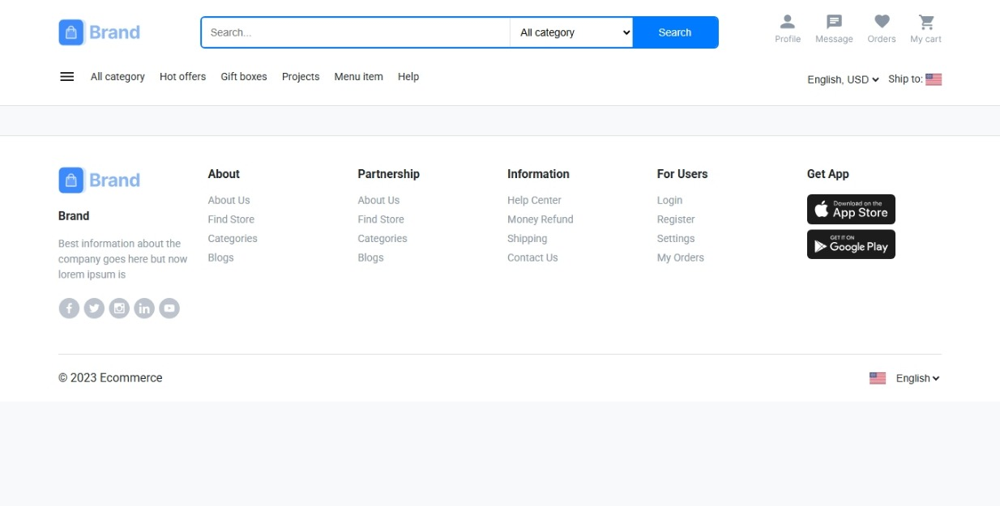

# Week 1: eCommerce Website - Header and Footer

## Overview
This README documents the Week 1 deliverables for the eCommerce website project, focusing on the implementation of the header and footer. The goal was to create a responsive, user-friendly, and visually consistent header and footer that match the provided Figma UI design.

# Live Demo:
- Your site is live [Live Demo](https://muzamal478.github.io/ecommerce-frontend-design/)

### Features
- **Header**:
  - Logo placement (top-left).
  - Search bar with category dropdown and search button.
  - User icons (profile, message, orders, cart).
  - Navigation menu with links (All category, Hot offers, etc.).
  - Language and shipping options.
- **Footer**:
  - Company info with social media icons (Facebook, Twitter, Instagram).
  - Links for About, Partnership, Information, and For Users sections.
  - App download buttons (App Store, Google Play).
  - Copyright notice.
- **Consistency**:
  - Uses Roboto font via Google Fonts.
  - Color scheme: `--primary-color: #007bff`, `--secondary-color: #6c757d`, `--background-color: #f8f9fa`.
- **Responsiveness**:
  - Tested on 1200px, 1440px, and 1920px screen sizes.
- **Interactivity**:
  - Basic search functionality implemented in `script.js`.

## File Structure
Relevant files for Week 1:
```
ecommerce-frontend-design/
├── index.html       # Contains the header and footer
├── styles.css       # Styling for header and footer
├── script.js        # JavaScript for search functionality
├── assets
├── README.md

```

## Setup Instructions
1. **Clone the Repository**:
   ```bash
   git clone https://github.com/muzamal478/ecommerce-frontend-design.git
   cd ecommerce-frontend-design
   ```
2. **Add Images**:
   - Export the following images from Figma and place them in `assets`:
     - header logo.
     - footer social icons.
     - footer app download buttons.
3. **Run the Project**:
   - Open `index.html` in a browser using a local server (e.g., VS Code Live Server).
4. **Test**:
   - Verify the header and footer design matches the Figma UI.
   - Test responsiveness on multiple screen sizes.

## Technologies Used
- **HTML5**: For structure.
- **CSS3**: For styling (consistent colors, hover effects).
- **JavaScript**: For search bar functionality.
- **Google Fonts**: Roboto font.

## Screenshots

